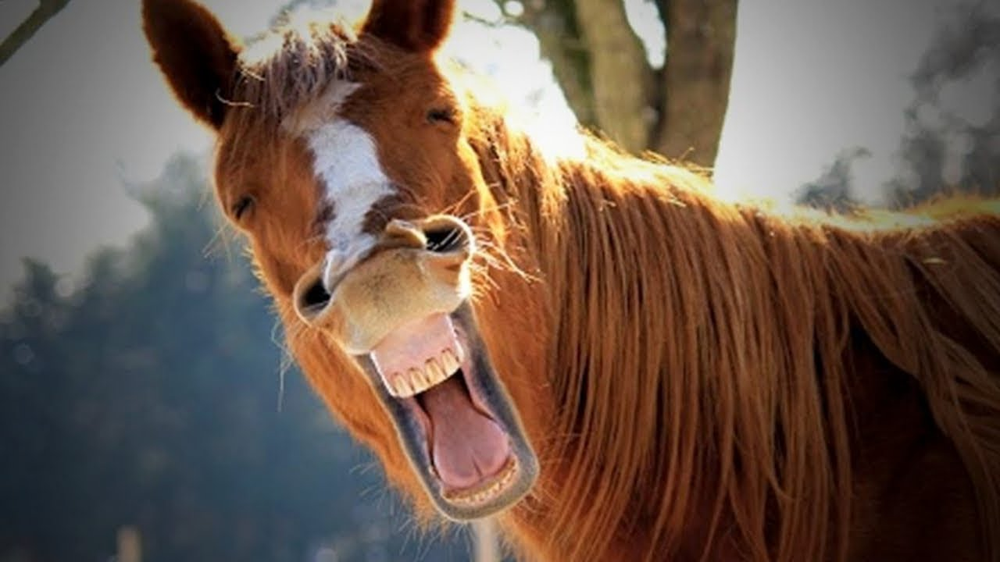

# IASC 2P02 | Rebecca Disley

**Note to students. DO NOT simply fill in the text here with your own words. Read the assignment sheet carefully and make sure you are doing everything it asks for.**

## Bio

I am a second-year student studying at Brock University. I am currently enrolled in the Interactive arts and science, or IASC, program. My research area in Digital Humanities is media archaeology. My work with my collaborative project and my research presentation are good examples of media archaeology. My collaborative project looks at The Map Of Early Modern London, or MoEML. The MoEML is an old map that has been uploaded to a website, along with relevant articles and archives of that era. The collaborative project focuses on how the MoEML is an example of media archeology. Additionally, my research presentation is focused on media archeology. My research presentation is about the teleprinter, and how it has led to, and draws parallels with contemporary technology, as well as where the teleprinter would be now if it remained a prevalent technology. The entire presentation revolves around media archaeology. In the future I would like to take the study of media archaeology even further. Seeing what can be learned about new media through old media. 

## Featured Project: [Defending Digital Humanities]

Contrary to what has been said about it, Digital Humanities is an established an important field of study. It has been said that it is impossible to combine the sciences and the humanities; the objective and the subjective. In this academic blog I discuss the various ways in which Digital Humanities has made it possible to combine, and study objective and subjective content. The writings of Alvarado, Kirschenbaum, and Moretti are used to support and develop my arguments. Parallels with contemporary software are drawn from Moretti’s research on book history. I use this along with additional research to specify areas in which Digital Humanities has succeeded and progressed. Various points are made about new forms of research which were not possible before Digital Humanities, or Humanities Computing, arrived on the scene. How scholars discovered patterns across large quantities of literary texts, how these patterns arose, and their importance is a driving component in my research. Additionally, I debunk some of the arguments made by Alvarado.  

Many revisions were made to this academic blog. Most changes were rooted in feedback from my instructor. An addition I made was to include an image and tie that image into my writing. This can be seen [here](https://github.com/LadyR2612/IASC-2P02/commit/696a2c3514968b0bdbf6190f30fd286b164c6be3). I chose to use an image from Voyant to help support the paragraph leading up to the image. Also, since text parsing and text visualization software is frequently mentioned in my writing, it felt appropriate in include an example. Another suggestion made to me by my instructor was to include the writings of Franco Moretti that had previously been discussed in lecture. This addition can be seen [here](https://github.com/LadyR2612/IASC-2P02/commit/7e8f71b9d3cd6d2e5a6bd883cf06ada66b19642f). This was an excellent suggestion as it gave more support to my already existing arguments, as well as leading me to write more about Defending Digital Humanities. Moretti’s text contains many graphs, and examples of analyzing big data to find patterns. I mention this, and similar subject throughout my academic blog. I was also instructed to include more of my own thoughts and insights on Digital Humanities, and the prompt given in the original assignment. This portion of the text can be found [here](https://github.com/LadyR2612/IASC-2P02/commit/3366c35af502a863b484c1a62923cab194381fb9). A section has been written where I drew my own conclusions on the arguments I had made in my academic blog. I also included another example of software that supports some of the previous points I had made. 

Read [Defending Digital Humanities](blog.md)

## Collaborative Project

Here is my 100-word project description.

Here is my 250-word collaboration statement. I approach collaboration in x ways, which is reflected in y work (available [here](https://github.com/IascAtBrock/IASC-2P02-TeamPresentations/commit/5ffe79e41eabd264a3ebece22f74ebaa9de748c6)). I also approach collaboration in a ways, which is reflected in b work (available [here](https://github.com/IascAtBrock/IASC-2P02-TeamPresentations/commit/2ae52b7e79c421887a29001ff5d54b49d09c7026)). I also contributed x assets to my team, seen below.

## Research Presentation

[Title goes here](reveal/index.html)

## Academic Blog

[Title goes here](blog)

